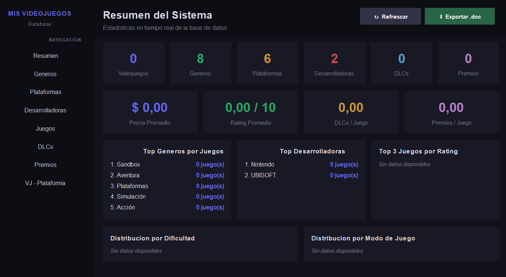

# Gestión de Videojuegos — Proyecto con Interfaz Gráfica

Aplicación Java para gestionar videojuegos y su información relacionada usando una interfaz gráfica de escritorio. El proyecto implementa el patrón DAO y conecta con una base de datos PostgreSQL remota para almacenar géneros, plataformas, desarrolladoras, videojuegos, DLCs, premios y la relación entre juegos y plataformas.

---

## Qué ofrece el proyecto

La aplicación permite:

- Navegar con una interfaz gráfica tipo dashboard
- Mostrar un panel resumen con información general
- Administrar géneros, plataformas, desarrolladoras, videojuegos, DLCs y premios
- Relacionar videojuegos con plataformas mediante un panel específico
- Realizar operaciones CRUD: ver, agregar, editar y eliminar registros
- Conectar con PostgreSQL usando credenciales definidas en `.env`

---

## Interfaz gráfica

La interfaz principal se ejecuta desde `gestionvideojuegos.ui.VentanaGUI` y contiene:

- `Sidebar`: navegación lateral con botones para cada sección
- `PanelResumen`: resumen general de la base de datos
- `PanelGeneros`: gestión de géneros
- `PanelPlataformas`: gestión de plataformas
- `PanelDesarrolladoras`: gestión de desarrolladoras
- `PanelVideojuegos`: gestión de videojuegos
- `PanelDlcs`: gestión de DLCs
- `PanelPremios`: gestión de premios
- `PanelVJPlataformas`: relación videojuego-plataforma

> El proyecto también incluye una versión de menú en consola (`gestionvideojuegos.Main` / `Menu.java`), pero la experiencia principal está pensada para ejecutarse con `VentanaGUI`.

---

## Captura de pantalla

Esta imagen muestra un ejemplo de la interfaz gráfica de la aplicación:



---

## Estructura del proyecto

```
GestionVideojuegos/
├── .env                  # Variables de entorno — NO se sube a Git
├── .gitignore            # Excluye .env y archivos compilados
├── README.md             # Este archivo
├── docs/                 # Documentación y diagramas
│   ├── diagrama.png      # Diagrama de clases del proyecto
│   └── img.png           # Ejemplo de la interfaz gráfica
├── pom.xml               # Configuración de Maven
└── src/
    └── main/
        └── java/
            └── gestionvideojuegos/
                ├── config/
                │   └── ConexionDB.java
                ├── dao/
                │   ├── DesarrolladoraDAO.java
                │   ├── DlcDAO.java
                │   ├── GeneroDAO.java
                │   ├── PlataformaDAO.java
                │   ├── PremioDAO.java
                │   ├── VideojuegoDAO.java
                │   └── VideojuegoPlataformaDAO.java
                ├── model/
                │   ├── Desarrolladora.java
                │   ├── Dlc.java
                │   ├── Genero.java
                │   ├── Plataforma.java
                │   ├── Premio.java
                │   ├── Videojuego.java
                │   └── VideojuegoPlataforma.java
                └── ui/
                    ├── ComponenteFactory.java
                    ├── Menu.java
                    ├── PanelDesarrolladoras.java
                    ├── PanelDlcs.java
                    ├── PanelGeneros.java
                    ├── PanelPlataformas.java
                    ├── PanelPremios.java
                    ├── PanelVideojuegos.java
                    ├── PanelVJPlataformas.java
                    ├── Sidebar.java
                    ├── VentanaGUI.java
                    └── Resumen/
                        ├── PanelResumen.java
                        └── ResumenDocxExporter.java
```

### Carpetas principales

- `config`: conexión a la base de datos PostgreSQL.
- `model`: clases que representan las entidades de la base de datos.
- `dao`: lógica de acceso a datos y operaciones CRUD.
- `ui`: componentes gráficos de Swing para la aplicación de escritorio.

---

## Base de datos

La aplicación usa PostgreSQL remoto (Neon u otro servicio compatible). Las tablas principales son:

| Tabla | Descripción |
|-------|-------------|
| genero | Categorías de videojuegos (RPG, Acción, Terror, etc.) |
| plataforma | Consolas y plataformas (PS5, Xbox, PC, Switch, etc.) |
| desarrolladora | Empresas desarrolladoras de videojuegos |
| videojuego | Información principal de cada juego |
| videojuego_plataforma | Relación entre videojuegos y plataformas |
| dlc | Contenidos descargables de cada juego |
| premio | Premios y reconocimientos del juego |

---

## Requisitos

- Java 26
- Maven
- PostgreSQL accesible desde la aplicación
- Archivo `.env` con credenciales de base de datos

---


## Cómo ejecutar la aplicación

### 1. Clonar el repositorio

```bash
git clone https://github.com/tuUsuario/GestionVideojuegos.git
cd GestionVideojuegos
```

### 2. Crear el archivo `.env`

En la raíz del proyecto, crear un archivo `.env` con:

```env
DB_URL=jdbc:postgresql://[host]/[nombre_bd]?sslmode=require
DB_USER=[usuario]
DB_PASSWORD=[password]
```

### 3. Instalar dependencias

```bash
mvn install
```

### 4. Ejecutar la interfaz gráfica

Desde IntelliJ IDEA, inicia la clase `gestionvideojuegos.ui.VentanaGUI`.

O con Maven:

```bash
mvn exec:java -Dexec.mainClass="gestionvideojuegos.ui.VentanaGUI"
```

### 5. Alternativa de consola

Si prefieres ejecutar el menú tradicional por consola:

```bash
mvn exec:java -Dexec.mainClass="gestionvideojuegos.Main"
```

---

## Dependencias

```xml
<dependencies>
    <dependency>
        <groupId>org.postgresql</groupId>
        <artifactId>postgresql</artifactId>
        <version>42.7.3</version>
    </dependency>
    <dependency>
        <groupId>io.github.cdimascio</groupId>
        <artifactId>dotenv-java</artifactId>
        <version>3.0.0</version>
    </dependency>
</dependencies>
```

---

## Patrón de diseño

Se utiliza el patrón **DAO (Data Access Object)** para separar:

- la lógica de presentación (`ui`)
- la lógica de negocio/entidades (`model`)
- el acceso a la base de datos (`dao`)

Esto facilita mantenimiento y escalabilidad.

---

## Diagrama de clases


---

## Credenciales

Las credenciales de base de datos no se suben al repositorio. Se cargan vía `.env` y el archivo se mantiene fuera del control de versiones.

---

## Autor

Felipe — Programación Orientada a Objetos, 2026

